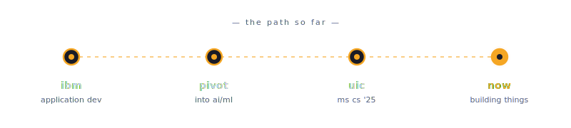

<div align="center">


<a href="https://heyvaish.dev">
  
</a>

</div>

---

### ✦ about

ms cs @ uic, graduating may 2027. started at ibm, then pivoted into ai/ml and the founder track.  
i ship more than i coursework. i'd love to see where my future lies, somewhere in an innovative env. basically, startups 🐝

### ⌒☆ the path so far

<div align="center">



</div>

### ✿ currently

- cooking **v1 of kindred**, a relationship intelligence engine for professional networking
- researching entropy-based selective prm verification for llm reasoning (cs 517)
- hunting summer 2026 internships at early-stage startups

### ✦ shipped

| project | tldr |
|---|---|
| **[redacted lore](https://github.com/VaishJadhavVJ/redacted-lore)** | collaborative worldbuilding on reddit. solo build. typescript, devvit, redis |
| **kindred** | relationship intelligence engine. best project @ trae/z.ai hackathon, uchicago |
| **urbanscale** | maskableppo warehouse placement for q-commerce. nvidia spark hack '25, top 30 nationally |
| **[chicago's loopback](https://github.com/VaishJadhavVJ/Chicago-s-LoopBack)** | civic tech for chicago. demonhacks, fully deployed |
| **ghar** | memory capture app with gemini. google deepmind hackathon |
| **[moral machine llm](https://github.com/VaishJadhavVJ/Moral-Machine-LLM-vs-Human-Ethical-Analysis)** | measuring moral divergence between humans and llms on the mit moral machine dataset |

### ✿ stack


### ⌒☆ current setup

```
editor       claude code, antigravity
notes        notion
deploy       cloudflare, supabase, snowflake, vercel, digital ocean
hours        midnight
fuel         coffee, songs i don't even understand, lock in
```

### ✦ find me

portfolio · [heyvaish.dev](https://heyvaish.dev)  
linkedin · [in/vaishnavipjadhav](https://www.linkedin.com/in/vaishnavipjadhav/)  
twitter · [@VaishnaviJ05](https://x.com/VaishnaviJ05)  

<div align="center">

<sub>🐝 thanks for stopping by the hive</sub>

</div>
